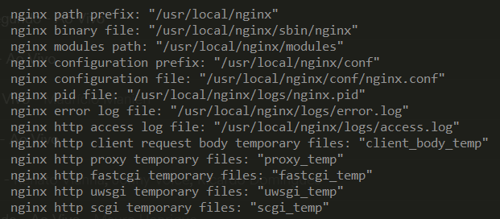

# About this repository

Series of scripts, documents and steps to harden linux installations.

All things described here should apply to most linux distributions, but are tested and based on Ubuntu 18.04.

# SSH

Reload SSH configuration without disconnecting and connecting again to prevent losing access in case you do something wrong [R1]

```sh
systemctl reload ssh.service
```

Backup SSH configuration before changing it [R1]

```sh
cp /etc/ssh/sshd_config /root/sshd_config
```

[sshd_config](https://github.com/tucaz/linux-hardening/blob/master/sshd_config) file with restrictions in place [R1]

- PermitRootLogin no
- MaxAuthTries 3
- PubkeyAuthentication yes
- IgnoreRhosts yes
- PasswordAuthentication no
- PermitEmptyPasswords no
- X11Forwarding no

# Creating non-root user [R2]

```sh
sudo adduser <username>
sudo usermod -aG sudo <username>
```

Test that the user works by running:

```
su - <username>
```

You will be logged in as <username> and should be able to see it's home directory `/home/<username>` and not access `/root/`

```sh
ls /root
ls: cannot open directory '/root': Permission denied
```
Once your user is created we need to give SSH access to it. The first step is to create a SSH key locally on the client that will be used to authenticate with the server [R3].

```sh
ssh-keygen -t rsa -b 4096 -C "your_email@example.com"
```

The `filename.pub` file is the public key and the other `filename` is your private key. Don't lose that file.

*Whenever you are creating a SSH key I recommend you to use a password. I don't, but it's at my own risk. Without a password anyone with your private key can access the server*

Now it's time to copy the public key into the server and add it to the list of authorized keys for your newly created user. I usually use `scp` from my local machine, but copy and paste can also be used [R4].

On the client:

```sh
cd /user/.ssh/
scp filename.pub root@your_server_address:/home/<username>/
```

On the server:

```sh
mkdir /home/<username>/.ssh
chmod 700 /home/<username>/.ssh
mv /home/<username>/filename.pub /home/<username>/.ssh/authorized_keys
chmod 600 /home/<username>/.ssh/authorized_keys
chown -R <username>:<username> /home/<username>/.ssh
```

Finally, let's try to login as the new user using the new key before we reload SSH and lose SSH access if we did something wrong.

On the client:

```sh
ssh -i filename.pub <username>@your_server_address
```

If you can login, and only if you can successfully login, you should now restart the SSH service in order to disable root access from SSH:

```sg
systemctl reload ssh.service
```

You can also remove the backup file you had:

```sh
rm /root/sshd_config
```

# Setting up a firewall [R6]

Verifying is ufw is active [R5]:

```sh
sudo ufw status
```

If UFW is not installed, run:

```sh
sudo apt-get install ufw
```

By default, it is a good idea to DROP all connections coming from the external world except for the few connections you want to explicitly allow.

```sh
sudo ufw default deny incoming
sudo ufw default allow outgoing
```

Now we allow for SSH, HTTP and HTTPS:

```sh
ufw allow ssh
ufw allow http
ufw allow https
```

When everything looks good and we are confidend about our rules:

```sh
sudo ufw enable
```
Now we have a firewall :)

# Sending email

I want to send emails from my server. In this particular case I want to send fail2ban notifications.

If you are using UFW as a firewall you probably want to allow emails to be sent from the machine:

```sh
ufw allow out 587
```

Now we install sendmail:

```sh
apt-get install sendmail
```

# Installing fail2ban

Fail2ban keeps track of attemps to log into SSH on your server. Once it passes a treshold it blocks that IP. It can probably do more, but that's enough for me now. It seems like the default configurations are pretty good as they are so it's just a matter of installing it.

```sh
sudo apt-get install fail2ban
```
# Installing NGINX

Since I want to use NGINX with the pagespeed [R9] mod I have to build it from source.

I use the automated install from R10 with the adittional parameters below:

```
--with-compat --with-file-aio --with-threads --with-http_addition_module --with-http_auth_request_module --with-http_dav_module --with-http_flv_module --with-http_gunzip_module --with-http_gzip_static_module --with-http_mp4_module --with-http_random_index_module --with-http_realip_module --with-http_secure_link_module --with-http_slice_module --with-http_ssl_module --with-http_stub_status_module --with-http_sub_module --with-http_v2_module --with-mail --with-mail_ssl_module --with-stream --with-stream_realip_module --with-stream_ssl_module --with-stream_ssl_preread_module
```

That will install NGINX in the folders below instead of the standard structure of `/etc/nginx/`.



## Creating user for nginx [R17]

```sh
 sudo adduser --system --no-create-home --group --disabled-login --disabled-password nginx
 ```

## Configuring NGINX as a system service

Once NGINX is installed it won't be configured to run as a service since we compiled it from source. 

When it is installed using `apt-get` it registers itself as a service by creating a SysV script. If you want to use that style of service management you can look at R11 or R12.

This post [R13] at StackOverflow has some cool information about how to discover what is being used. A few quotes:

```
You can poke around the system to find indicators. One way is to check for the existence of three directories:

- /usr/lib/systemd tells you you're on a systemd based system.
- /usr/share/upstart is a pretty good indicator that you're on an Upstart-based system.
- /etc/init.d tells you the box has SysV init in its history
```

and

```
The init process is always assigned PID 1. The /proc filesystem provides a way to obtain the path to an executable given a PID.
```

```sh
sudo stat /proc/1/exe
```

I'm going to use SystemD since it seems to be what cool kids use nowadays and I need to familiarize myself with it. My [nginx.service](/config/systemd/nginx.service) comes from R14.

You should just place it in `/etc/systemd/system` and reload the services daemon [R15][R16]:

```sh
cd /etc/systemd/system/
sudo wget https://raw.githubusercontent.com/tucaz/linux-hardening/master/configs/systemd/nginx.service
sudo chmod 664 nginx.service
sudo systemctl daemon-reload
sudo systemctl enable nginx
sudo systemctl start nginx
```

Make sure that `PIDFile` from nginx.service points to the same place as `pid` inside `nginx.conf`.

NGINX is running! \o/

# Configuring NGINX

The base configuration file of nginx is located on `/usr/local/nginx/conf/nginx.conf` this is the one I'm using: [nginx.conf](configs/nginx/nginx.conf)

## Adding HTTPS

- https://certbot.eff.org/lets-encrypt/ubuntubionic-nginx
- https://www.digitalocean.com/community/tutorials/how-to-secure-nginx-with-let-s-encrypt-on-ubuntu-18-04

```sh
sudo apt install nginx python-certbot-nginx 
sudo mkdir /usr/local/certbot/
certbot --nginx --nginx-server-root /usr/local/nginx/conf/ --work-dir /usr/local/certbot/ --logs-dir /usr/local/certbot/logs
```

See [R18] for details on passing parameters to certbot plugin for nginx

# PHP

To run php with nginx we need php-fpm and a few extensions that wordpress uses:

- php-xml - Load/parse XML
- php-curl - Call `curl` from PHP
- php-mysql - MySql driver for PHP

```sh
sudo apt-get install php-fpm php-mysql php-curl php-xml
```

Creating a user for PHP to run and making it part of the nginx group:

```sh
sudo useradd --shell /bin/false -M -G nginx wwwphp
sudo usermod -L wwwphp
```

This will be added as the php-fpm pool user (add pool.conf).

# MySql

## Percona toolkit

List of MySql tools that help administration and troubleshooting (free) https://www.percona.com/doc/percona-toolkit/LATEST/installation.html

```sh
sudo apt-get install percona-toolkit
```

# Wordpress

## Folder permissions

From [R19] and [R20] within the wordpress folder:

```sh
sudo find . -type d -exec chmod 750 {} \;
sudo find . -type f -exec chmod 640 {} \;
sudo chmod 600 wp-config.php
```

More references that I still have to apply:

- [R21]
- [R22]

# NodeJS

Before installing NodeJS let's create a user that will run all the node applications. Creating a user for NodeJS apps and making it part of the nginx group. It also makes the home folder writable by the `nginx` group which my main user belongs to so we can later install and run nodejs under this user.

```sh
sudo useradd --shell /bin/bash --create-home --comment 'NodeJS Applications User' -g nginx wwwnodejs
sudo usermod -L wwwnodejs
```

## Installing NodeJS and NPM as root (not recommended, but easier)

```sh
sudo apt-get install nodejs npm
```

Manage NodeJS processes with PM2 [R23]:

```sh
sudo npm install -g pm2
```

Creates template file for pm2:

```sh
sudo pm2 init
```
## Installing NodeJS and NPM as non-root [R24][R25][R26]

This will install nodejs for the user `wwwnodejs` which is the user we created especially for the purpose of running our node applications.

```sh
sudo apt-get install xz-utils
sudo su - wwwnodejs # change to user wwwnodejs so we can install NodeJS under it
cd ~
mkdir .npm-packages # creates the folder which will hold all packages that NPM installs
wget https://nodejs.org/dist/v11.3.0/node-v11.3.0-linux-x64.tar.xz
tar -xf node-v11.3.0-linux-x64.tar.xz
exit # go back to our main user so we can move NodeJS installation where we want it
sudo mv /home/wwwnodejs/node-v11.3.0-linux-x64 /usr/local/node
sudo su - wwwnodejs
echo 'export PATH=$HOME/.npm-packages/bin:$PATH' >> ~/.bashrc
echo 'export PATH=/usr/local/sbin:$PATH' >> ~/.bashrc
. ~/.bashrc
npm config set prefix ~/.npm-packages
npm install -g npm # "installs" NPM for this user 
exit
echo 'export PATH=/home/wwwnodejs/.npm-packages/bin:$PATH' >> ~/.bashrc
. ~/.bashrc
```

### Installing PM2 as non-root user and make it a service [R27]

```sh
sudo su - wwwnodejs
npm install -g pm2
exit # go back to our main user that has powers to change systemd services
sudo env PATH=$PATH:/usr/local/node/bin /home/wwwnodejs/.npm-packages/lib/node_modules/pm2/bin/pm2 startup systemd -u wwwnodejs --hp /home/wwwnodejs
sudo systemctl start pm2-wwwnodejs
```

# PostgreSql

PostgreSql authentication is based on a linux user. To access it:

```sh
sudo su - postgres
psql
```

Useful commands:

- `\q` - Exist the psql console
- `\l` - Lists all databases in the server
- `\du` - List of users/roles
- `SELECT grantee, privilege_type FROM information_schema.role_table_grants` - List detailed privileges for each table

# References

- [R1] - https://linux-audit.com/audit-and-harden-your-ssh-configuration/
- [R2] - https://www.digitalocean.com/community/tutorials/how-to-create-a-sudo-user-on-ubuntu-quickstart
- [R3] - https://help.github.com/articles/generating-a-new-ssh-key-and-adding-it-to-the-ssh-agent/
- [R4] - https://linux-audit.com/using-ssh-keys-instead-of-passwords/
- [R5] - https://askubuntu.com/questions/533269/how-to-check-if-ufw-is-running-programmatically
- [R6] - https://www.digitalocean.com/community/tutorials/how-to-set-up-a-firewall-with-ufw-on-ubuntu-18-04
- [R7] - https://www.digitalocean.com/community/tutorials/how-to-protect-ssh-with-fail2ban-on-ubuntu-14-04
- [R8] - https://www.linode.com/docs/security/using-fail2ban-for-security/
- [R9] - https://developers.google.com/speed/pagespeed/module/
- [R10] - https://www.modpagespeed.com/doc/build_ngx_pagespeed_from_source
- [R11] - https://tutorials.technology/tutorials/00-install-nginx-from-source.html
- [R12] - http://kbeezie.com/debian-ubuntu-nginx-init-script/
- [R13] - https://unix.stackexchange.com/questions/196166/how-to-find-out-if-a-system-uses-sysv-upstart-or-systemd-initsystem
- [R14] - https://www.nginx.com/resources/wiki/start/topics/examples/systemd/
- [R15] - https://access.redhat.com/documentation/en-us/red_hat_enterprise_linux/7/html/system_administrators_guide/sect-managing_services_with_systemd-unit_files
- [R16] - https://www.digitalocean.com/community/tutorials/how-to-configure-a-linux-service-to-start-automatically-after-a-crash-or-reboot-part-1-practical-examples
- [R17] - https://serverfault.com/a/469102/75242
- [R18] - https://github.com/certbot/certbot/issues/718
- [R19] - https://codex.wordpress.org/Changing_File_Permissions
- [R20] - https://codex.wordpress.org/Hardening_WordPress
- [R21] - https://wpsecure.net/secure-wordpress/
- [R22] - https://makeawebsitehub.com/wordpress-security/
- [R23] - https://pm2.io/runtime/
- [R24] - https://stackoverflow.com/a/31046037/147453
- [R25] - https://johnpapa.net/node-and-npm-without-sudo/
- [R26] - https://gist.github.com/isaacs/579814
- [R27] - http://pm2.keymetrics.io/docs/usage/startup/
